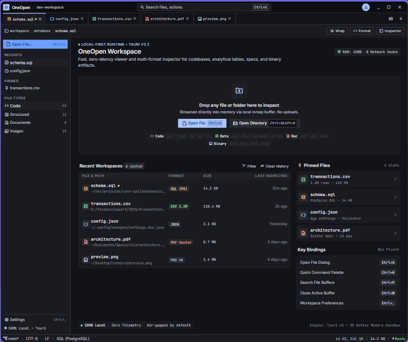

<div align="center">


# OneOpen

**A lightweight, local-first Tauri desktop workspace for instantly viewing any file.**

[](https://github.com/Naveen-354/file-viewer/releases/latest)
[](https://github.com/Naveen-354/file-viewer/releases/latest)
[](https://tauri.app)
[](#)
[](LICENSE)

[Download](#download) · [Features](#features) · [Getting started](#getting-started) · [Building from source](#building-from-source) · [Contributing](#contributing)

</div>

---

## Overview

OneOpen detects untrusted files and opens them in lazy-loaded, sandboxed viewers — no cloud upload, no telemetry, everything streamed directly from disk into memory. Drop in a file or folder and OneOpen picks the right viewer automatically: source code, JSON/XML, CSV/TSV, images and media, PDF, Excel workbooks, Word documents, ZIP archives, and a metadata/hex fallback for anything else.

New contributors and coding agents should start with [`PROJECT_CONTEXT.md`](PROJECT_CONTEXT.md) for architecture and conventions.

<div align="center">
  
</div>

## Features

- **Universal viewer** — text/source, JSON, XML, CSV/TSV, images, media, PDF, `.xlsx`/`.xlsm`, `.docx`, ZIP, and a hex/metadata fallback for unknown formats
- **Markdown** — source and editable rich-text modes
- **PDF editing** — annotate with text, rotate, prune, undo, and save in place
- **Excel** — resizable columns, per-column filters, and cell editing saved back to the workbook
- **Image conversion** — any decodable image (including SVG) can be converted to another format from the viewer's Convert button
- **Local-first** — files are streamed via memory-mapped buffers; nothing leaves your machine
- **Zero-config file associations** — install once and open supported files straight from Explorer

## Download

Prebuilt Windows installers (MSI and NSIS) are published on the [Releases page](https://github.com/Naveen-354/file-viewer/releases/latest).

[](https://github.com/Naveen-354/file-viewer/releases/latest)

No release has shipped yet? Build it yourself in a few minutes — see [Building from source](#building-from-source).

## Getting started

1. Download and run the installer from the [Releases page](https://github.com/Naveen-354/file-viewer/releases/latest).
2. Launch **OneOpen**, then drag a file or folder onto the window, or use **Open File** / **Open Directory**.
3. Optionally, right-click a supported file in Explorer → **Open with** → **OneOpen** to set it as the default viewer for that type.

## Building from source

### Prerequisites (Windows 10/11)

Install WebView2 (included with current Windows), the Visual C++ build tools, Rust stable, Node.js LTS, and pnpm:

```powershell
winget install Microsoft.VisualStudio.2022.BuildTools --override "--wait --passive --add Microsoft.VisualStudio.Workload.VCTools --includeRecommended"
winget install Rustlang.Rustup
winget install OpenJS.NodeJS.LTS
rustup default stable
npm install --global pnpm@10.15.0
```

See the [Tauri Windows prerequisites](https://v2.tauri.app/start/prerequisites/) if a compiler or WebView2 component is missing, and [`BUILD_AND_RUN.md`](BUILD_AND_RUN.md) for the full walkthrough, including fixes for a broken `pnpm` shim from Node's bundled Corepack.

### Install dependencies

```powershell
pnpm install
```

### Run in development mode

```powershell
pnpm tauri dev
```

Open files at startup by appending quoted paths:

```powershell
pnpm tauri dev -- "C:\path with spaces\sample.txt" "C:\data\sample.json"
```

Opening a second OneOpen process forwards its file arguments to the existing process.

### Run the test suite

```powershell
pnpm lint
pnpm test
pnpm build
Push-Location src-tauri
cargo fmt --all -- --check
cargo clippy --all-targets -- -D warnings
cargo test --all-targets
Pop-Location
```

### Production build

```powershell
pnpm tauri build
```

### Create the Windows installer

Both MSI and NSIS targets are configured:

```powershell
pnpm tauri build -- --bundles msi,nsis
Get-ChildItem .\src-tauri\target\release\bundle -Recurse
```

### Register and test file associations

File associations are centralized in `src-tauri/tauri.conf.json`. Build and install the generated NSIS package, then select OneOpen once from Explorer's **Open with** menu:

```powershell
$installer = Get-ChildItem .\src-tauri\target\release\bundle\nsis\*.exe | Select-Object -First 1
Start-Process -FilePath $installer.FullName -Wait
Start-Process -FilePath "C:\path with spaces\sample.txt"
```

To test argument forwarding without changing the default application, start the installed `OneOpen.exe` twice with different quoted file paths.

## Safety limits

Text editing is capped at 16 MiB, Markdown rich-text mode at 2 MiB, and larger text files get a bounded read-only preview. PDF editing is capped at 24 MiB input and 64 MiB output. Structured trees, images, PDF, and media use separate bounded preview limits. CSV parsing stops at 64 MiB or 100,000 rows. Image conversion is capped at 80 MiB input, 100 megapixels, and 128 MiB output. Workbooks are capped at 48 MiB and 500,000 cells per sheet; Word documents at 32 MiB, 20,000 blocks, and 8 MiB of text. ZIP extraction rejects unsafe paths, links, suspicious ratios, entries over 1 GiB, more than 100,000 files, and more than 4 GiB total decompressed data.

Application data is stored in SQLite in Tauri's per-user app-data directory. File contents are never stored in the database.

## Contributing

Contributions are welcome — see [`CONTRIBUTING.md`](CONTRIBUTING.md) for coding conventions and the pre-submission checklist, and [`SECURITY.md`](SECURITY.md) to report a vulnerability.

## License

Licensed under the [MIT License](LICENSE).
